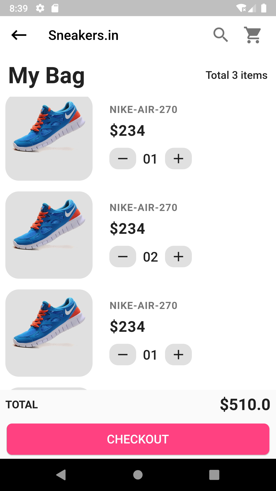

# shop_app

UI Shop App

## Getting Started

So, what I have created is a Shopping App UI using Dart Language as a Flutter Project

So, here are some of the screenshots of my App UI

# WELCOME SCREEN

 

# USER LOGIN AND REGISTER SCREENS

  

# HOME PAGE & DRAWER SCREEN

  

# DETAIL PAGE OF A PRODUCT

# CART PAGE 

# UPI PAYMENT GATEWAY 

